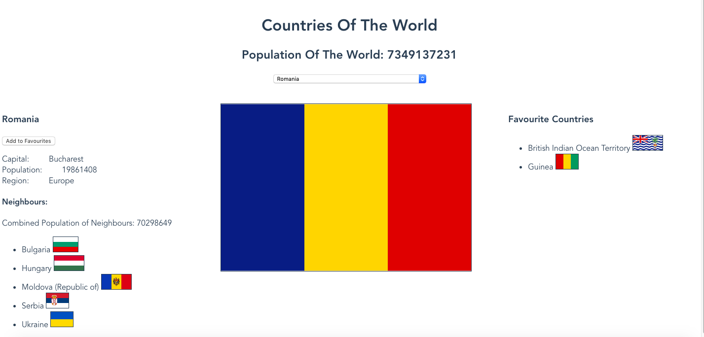

# countries_api

This app obtains various information about the countries of the world from an API - https://restcountries.eu/rest/v2/all - and displays it in a user friendly manner. 

## Project setup
```
npm install
```

### Compiles and hot-reloads for development
```
npm run serve
```

### Compiles and minifies for production
```
npm run build
```

In your browser, navigate to http://localhost:8080/ to see the app's main page.



### Customize configuration
See [Configuration Reference](https://cli.vuejs.org/config/).
